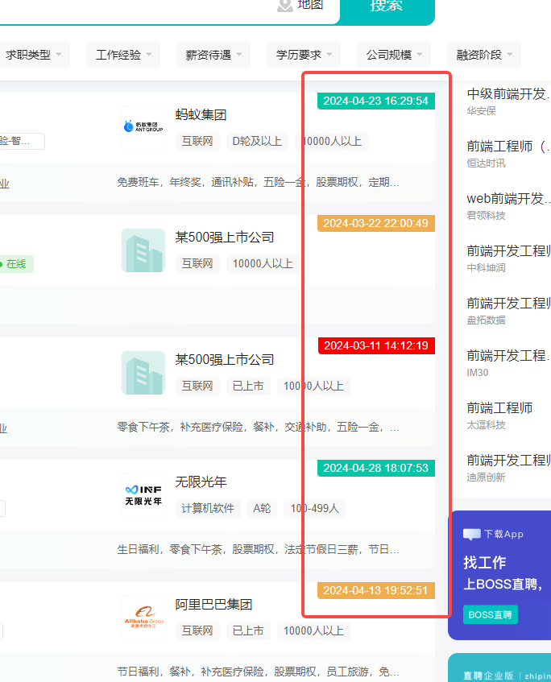

最近被嘎，boss 刷烂了，老有那些半年前的岗位，搞了个 web 端 boss 插件，显示最新修改的职位时间。
boss 色 智联色 ：代表两周内
橙色：一个半月内
红色：一个半月以上

```js
yarn

yarn build
```

然后打开谷歌浏览器

```
chrome://extensions/
```

扩展程序 => 加载已经解压的扩展程序 => 选中 clone 的项目 => 选择 build 文件夹 => 点击确定
即可加载 new job 插件

# 非程序员的同学

切换的 useBuild 分支 然后通过 zip 包下载，解压之后 直接使用 build 文件夹就好了。

# 以下是 boss 和智联的效果图



